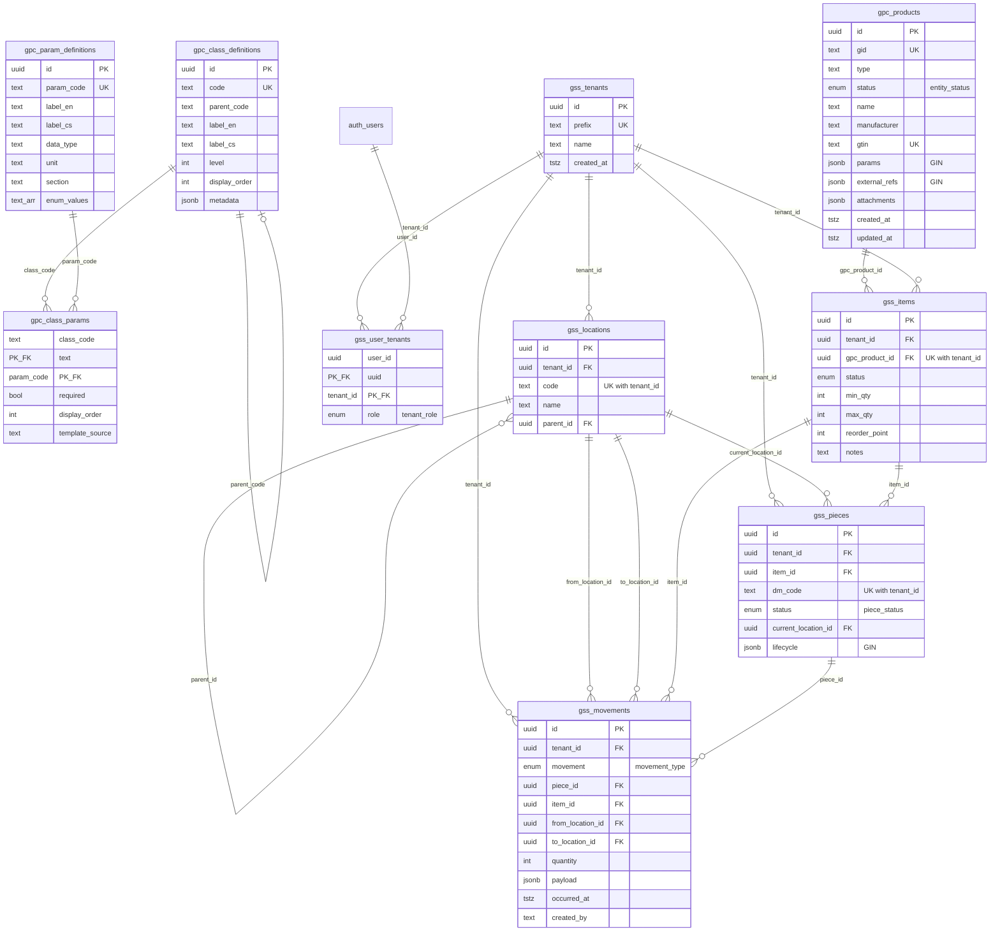

# GOGROU — Supabase Database Schema

> **Project:** `wmvpcpkphhpyiiqsqvmh` · region `eu-central-1` · PostgreSQL 17.6
> **Stav:** produkce, RLS aktivní na všech tabulkách
> **Generováno:** z živého schématu

---

## 1. Tři logické vrstvy

GOGROU databáze stojí na **třech ortogonálních vrstvách**, které spolu komunikují přes FK:

```
┌──────────────────────────────────────────────────────────────────────┐
│  GPC  —  Gogrou Product Center                                       │
│  Sdílený katalog nástrojů (manufaktura, ne reseller).                │
│  Tenant-agnostic. RLS: SELECT all, WRITE jen global admin.           │
│                                                                      │
│  gpc_products  ◀──── gpc_class_definitions ──┐                       │
│                       └─ gpc_class_params ───┴── gpc_param_defs      │
│                                                                      │
└─────────────────┬────────────────────────────────────────────────────┘
                  │ FK (gss_items.gpc_product_id)
                  ▼
┌──────────────────────────────────────────────────────────────────────┐
│  GSS  —  Gogrou Stock System                                         │
│  Per-tenant skladová data. RLS: scope podle tenant_id.               │
│                                                                      │
│  gss_tenants ◀── gss_locations (self-ref strom)                      │
│       ▲              ▲                                               │
│       │              │                                               │
│       │     gss_items (= SKU per tenant)                             │
│       │              │                                               │
│       │              ▼                                               │
│       │     gss_pieces (= fyzické kusy, 1 DataMatrix kód = 1 piece)  │
│       │              │                                               │
│       │              ▼                                               │
│       └────── gss_movements (append-only audit log)                  │
│                                                                      │
└─────────────────▲────────────────────────────────────────────────────┘
                  │ FK (gss_user_tenants.tenant_id)
                  │
┌─────────────────┴────────────────────────────────────────────────────┐
│  AUTH  —  Multi-tenant user mapping                                  │
│  Provazuje auth.users (Supabase Auth) ↔ tenant + role.               │
│                                                                      │
│  auth.users  ─── gss_user_tenants (M:N s rolí) ─── gss_tenants       │
│                                                                      │
└──────────────────────────────────────────────────────────────────────┘
```

---

## 2. ASCII ER diagram

```
                       ┌────────────────────────────┐
                       │     gpc_class_definitions  │
                       │  (76 ř. — taxonomie tříd)  │
                       │  PK: id                    │
                       │  UQ: code                  │
                       │  • parent_code (self-FK?)  │
                       │  • label_en, label_cs      │
                       │  • level, display_order    │
                       │  • metadata jsonb          │
                       └─────────────┬──────────────┘
                                     │ 1:N (class_code)
                                     ▼
                       ┌────────────────────────────┐
                       │      gpc_class_params      │
                       │  (402 ř. — pivot M:N)      │
                       │  PK: (class_code,          │
                       │       param_code)          │
                       │  • required bool           │
                       │  • display_order           │
                       │  • template_source         │
                       └─────────────┬──────────────┘
                                     │ N:1 (param_code)
                                     ▼
                       ┌────────────────────────────┐
                       │    gpc_param_definitions   │
                       │  (138 ř. — master katalog) │
                       │  PK: id  ·  UQ: param_code │
                       │  • label_en/cs, data_type  │
                       │  • unit, section           │
                       │  • description_en/cs       │
                       │  • enum_values text[]      │
                       └────────────────────────────┘

                       ┌────────────────────────────┐
                       │       gpc_products         │
                       │  (6 987 ř. — produkty)     │
                       │  PK: id (uuid)             │
                       │  UQ: gid                   │
                       │  UQ: gtin (where not null) │
                       │  • type, status            │
                       │  • name, manufacturer      │
                       │  • params       jsonb ◀── GIN: jsonb_path_ops
                       │  • external_refs jsonb ◀── GIN: jsonb_path_ops
                       │  • attachments  jsonb      │
                       │  + 13 PARTIAL indexů na    │
                       │    horké path filtry per   │
                       │    type (drill diam/coat,  │
                       │    endmill, insert, hold.) │
                       └─────────────┬──────────────┘
                                     │ 1:N
                                     │ (gpc_product_id)
                                     ▼
   ┌────────────────────┐    ┌─────────────────────────┐
   │   gss_tenants      │    │       gss_items         │
   │   (3 ř.)           │    │  (17 ř. — SKU/tenant)   │
   │   PK: id           │    │   PK: id                │
   │   UQ: prefix       │◀───┤   FK: tenant_id         │
   │   • name           │ 1:N│   FK: gpc_product_id    │
   └────────┬───────────┘    │   UQ: (tenant_id,       │
            │                │       gpc_product_id)   │
            │                │   • min_qty, max_qty    │
            │                │   • reorder_point       │
            │                │   • status, notes       │
            │                └────────────┬────────────┘
            │                             │ 1:N
            │ 1:N (tenant_id)             │ (item_id)
            ▼                             ▼
   ┌────────────────────┐    ┌─────────────────────────┐
   │  gss_locations     │    │       gss_pieces        │
   │  (12 ř. — strom)   │◀───┤  (54 ř. — fyz. kusy)    │
   │  PK: id            │ 1:N│   PK: id                │
   │  UQ: (tenant_id,   │    │   FK: tenant_id         │
   │       code)        │    │   FK: item_id           │
   │  • parent_id (self)│    │   FK: current_location  │
   │  • name            │    │   UQ: (tenant_id,       │
   └────────┬───────────┘    │        dm_code)         │
            │                │   • status (piece_st.)  │
            │                │   • lifecycle  jsonb    │
            │                │     ◀── GIN gin_piece_lifecycle
            │                └────────────┬────────────┘
            │                             │ 1:N
            │ 0:N (from/to_location_id)   │ (piece_id, item_id)
            ▼                             ▼
   ┌─────────────────────────────────────────────────────┐
   │              gss_movements                          │
   │              (96 ř. — append-only audit)            │
   │   PK: id                                            │
   │   FK: tenant_id, piece_id?, item_id?, from?, to?    │
   │   • movement   movement_type (receive/issue/…)      │
   │   • quantity   int                                  │
   │   • payload    jsonb                                │
   │   • occurred_at, created_by                         │
   │   IDX: (tenant_id, occurred_at DESC)                │
   │        (item_id, occurred_at DESC)                  │
   │        (piece_id, occurred_at DESC)                 │
   └─────────────────────────────────────────────────────┘

   ┌────────────────────┐         ┌─────────────────────┐
   │    auth.users      │◀────────┤  gss_user_tenants   │
   │  (Supabase Auth)   │   M:N   │  (6 ř. — mapping)   │
   │                    │  s rolí │  PK: (user_id,      │
   └────────────────────┘         │       tenant_id)    │
                                  │  • role tenant_role │
                                  │    (viewer/operator/│
                                  │     supervisor/     │
                                  │     admin)          │
                                  └──────────┬──────────┘
                                             │ N:1
                                             ▼
                                  ┌─────────────────────┐
                                  │     gss_tenants     │
                                  └─────────────────────┘
```

---

## 3. Mermaid ER diagram (renderuje se na GitHubu)



---

## 4. Tabulky — detail

### 4.1 GPC vrstva (katalog, sdílený)

| Tabulka | Řádků | Účel | Klíčové sloupce |
|---|--:|---|---|
| **`gpc_products`** | 6 987 | Technická definice produktu (drill, endmill, insert, holder, tap…). | `gid` (UQ), `type`, `params jsonb`, `external_refs jsonb` |
| **`gpc_class_definitions`** | 76 | Hierarchická taxonomie tříd (`machining → drilling → solid_carbide → drill`). | `code` (UQ), `parent_code`, `level` |
| **`gpc_param_definitions`** | 138 | Master katalog parametrů (`DC`, `OAL`, `IC`, `COMPC`…). TU/GPC kódy. | `param_code` (UQ), `data_type`, `unit`, `section` |
| **`gpc_class_params`** | 402 | M:N — jaké parametry patří k jaké třídě. | PK `(class_code, param_code)`, `required` |

### 4.2 GSS vrstva (per-tenant, RLS-scoped)

| Tabulka | Řádků | Účel | Klíčové sloupce |
|---|--:|---|---|
| **`gss_tenants`** | 3 | Multi-tenant root. Prefix = krátký kód (DEV01, ARGO, METROVA). | `prefix` (UQ) |
| **`gss_locations`** | 12 | Strom skladových lokací per tenant (self-ref přes `parent_id`). | UQ `(tenant_id, code)` |
| **`gss_items`** | 17 | SKU = (tenant, gpc_product). Stock policy (min/max/reorder). | UQ `(tenant_id, gpc_product_id)` |
| **`gss_pieces`** | 54 | Fyzický kus s DataMatrix kódem. Status = lifecycle. | UQ `(tenant_id, dm_code)`, `lifecycle jsonb` |
| **`gss_movements`** | 96 | Append-only audit log pohybů. | `(tenant_id, occurred_at DESC)` idx |

### 4.3 Auth vrstva

| Tabulka | Řádků | Účel | Klíčové sloupce |
|---|--:|---|---|
| **`gss_user_tenants`** | 6 | Pivot `auth.users` ↔ `gss_tenants` + role. | PK `(user_id, tenant_id)`, `role tenant_role` |

---

## 5. Enums

```sql
entity_status   = active | phasing_out | discontinued
piece_status    = new | in_stock | in_preset | in_machine | in_production | in_service | scrapped
movement_type   = receive | issue | transfer | service_out | service_in | scrap | adjust
tenant_role     = viewer | operator | supervisor | admin
```

**Role capability matrix** (vynucováno v `src/lib/tenant.ts`):

| Capability | viewer | operator | supervisor | admin |
|---|:-:|:-:|:-:|:-:|
| Číst katalog (GPC) | ✓ | ✓ | ✓ | ✓ |
| Číst sklad (GSS) | ✓ | ✓ | ✓ | ✓ |
| Skenovat / přesouvat kusy | – | ✓ | ✓ | ✓ |
| Editovat položky (`gss_items`) | – | – | ✓ | ✓ |
| Spravovat lokace | – | – | ✓ | ✓ |
| Pozvat uživatele do tenanta | – | – | – | ✓ |

---

## 6. RPC funkce (PL/pgSQL)

| Funkce | Návrat | Účel |
|---|---|---|
| `gpc_search(p_type, p_status, p_text, p_filters jsonb, p_sort jsonb, p_limit, p_offset)` | `setof record` | Univerzální full-text + JSONB filter search nad `gpc_products`. Podporuje ops `eq/neq/gte/lte/gt/lt/like/in`. Vrací `total_count` v každém řádku (window). |
| `gss_user_tenant_ids()` | `setof uuid` | **RLS helper.** Vrací všechny `tenant_id`, ke kterým má current `auth.uid()` přístup. SECURITY DEFINER. |
| `gss_user_role_in(p_tenant uuid)` | `tenant_role` | Vrací roli usera v daném tenantovi (NULL pokud nemá). |
| `gss_user_is_global_admin()` | `boolean` | True jen pokud user je `admin` ve **všech** svých tenantech (= globální admin pro GPC writes). |

---

## 7. Views (analytics pro GINA AI)

| View | Účel |
|---|---|
| `gpc_class_schema` | Join `gpc_class_definitions` + `gpc_class_params` + `gpc_param_definitions` → kompletní schema třídy. Použito ve frontendu pro dynamický rendering polí. |
| `gina_lifecycle_summary` | Agregace lifecycle stavů kusů per tenant. |
| `gina_movement_velocity` | Spotřeba/příjem za rolling window. |
| `gina_service_backlog` | Co je v servisu déle než N dní. |
| `gina_top_consumed` | Top SKU dle spotřeby. |

---

## 8. RLS strategie

**Princip:** GPC = veřejný read, write jen global admin. GSS = tenant-scoped pro vše.

### 8.1 GPC tabulky (`gpc_*`)

```sql
-- SELECT: kdokoli přihlášený (i napříč tenanty)
USING (true)

-- WRITE (INSERT/UPDATE/DELETE): jen global admin
USING (gss_user_is_global_admin())
WITH CHECK (gss_user_is_global_admin())
```

### 8.2 GSS tabulky (`gss_items`, `gss_locations`, `gss_pieces`, `gss_movements`)

```sql
-- ALL operace: tenant musí být v user_tenants daného usera
USING      (tenant_id IN (SELECT gss_user_tenant_ids()))
WITH CHECK (tenant_id IN (SELECT gss_user_tenant_ids()))
```

### 8.3 `gss_tenants` (parent)

```sql
-- SELECT jen mé tenants
USING (id IN (SELECT gss_user_tenant_ids()))
```

### 8.4 `gss_user_tenants` (mapping)

```sql
-- SELECT jen vlastní řádky
USING (user_id = auth.uid())
-- WRITE: spravuje se centrálně, RLS WRITE policy nedefinována → no public write
```

---

## 9. Indexy — klíčové

### 9.1 GPC GIN (full JSONB search)
- `gin_gpc_params` na `params jsonb_path_ops`
- `gin_gpc_external_refs` na `external_refs jsonb_path_ops`

### 9.2 GPC partial (per-type hot filters)
- `ix_gpc_drill_diam` — `params→geometry→diameter_mm::numeric` WHERE `type='tool.drill'`
- `ix_gpc_drill_coating` — `params→coating→gpc_coating_gid` WHERE `type='tool.drill'`
- `ix_gpc_drill_material` — `params→material→base` WHERE `type='tool.drill'`
- `ix_gpc_endmill_diam` / `_radius` / `_teeth` WHERE `type='tool.endmill'`
- `ix_gpc_insert_iso_code` / `_material_group` / `_nose_radius` WHERE `type='tool.insert'`
- `ix_gpc_holder_interface` / `_clamp_diam` WHERE `type='tool.holder'`
- `ix_gpc_coating_family` / `_trade` WHERE `type='coating'`
- `ix_gpc_type_status` na `(type, status)` — list views

### 9.3 GSS partial / hot path
- `ix_pieces_instock` na `item_id` WHERE `status='in_stock'` — low-stock dashboard
- `ix_movements_tenant_time` na `(tenant_id, occurred_at DESC)`
- `ix_movements_item_time` na `(item_id, occurred_at DESC)` — item history
- `ix_movements_piece_time` na `(piece_id, occurred_at DESC)` — piece history
- `gin_piece_lifecycle` GIN na `lifecycle jsonb_path_ops`

### 9.4 Unique constraints (business rules)
- `ux_gpc_gid` — globálně unikátní `gid`
- `ux_gpc_gtin_notnull` — GTIN unikátní, jen pokud není NULL
- `ux_item_per_tenant_product` — 1 SKU = 1 (tenant, product)
- `ux_piece_dm_per_tenant` — DataMatrix kód unikátní v rámci tenanta
- `ux_loc_code_per_tenant` — kód lokace unikátní v rámci tenanta
- `ux_tenant_prefix` — globálně unikátní prefix tenanta

---

## 10. FK relationship matrix

| From → To | Cardinality | Sloupec |
|---|---|---|
| `gss_items.gpc_product_id` → `gpc_products.id` | N:1 | sdílený katalog |
| `gss_items.tenant_id` → `gss_tenants.id` | N:1 | tenant scope |
| `gss_locations.tenant_id` → `gss_tenants.id` | N:1 | tenant scope |
| `gss_locations.parent_id` → `gss_locations.id` | N:1 (self) | strom lokací |
| `gss_pieces.tenant_id` → `gss_tenants.id` | N:1 | tenant scope |
| `gss_pieces.item_id` → `gss_items.id` | N:1 | kusy patří k SKU |
| `gss_pieces.current_location_id` → `gss_locations.id` | N:1 | kde kus aktuálně leží |
| `gss_movements.tenant_id` → `gss_tenants.id` | N:1 | tenant scope |
| `gss_movements.piece_id` → `gss_pieces.id` | N:1 (nullable) | pohyb konkrétního kusu |
| `gss_movements.item_id` → `gss_items.id` | N:1 (nullable) | hromadný pohyb (bez DM) |
| `gss_movements.from_location_id` → `gss_locations.id` | N:1 (nullable) | zdroj |
| `gss_movements.to_location_id` → `gss_locations.id` | N:1 (nullable) | cíl |
| `gss_user_tenants.user_id` → `auth.users.id` | N:1 | Supabase Auth |
| `gss_user_tenants.tenant_id` → `gss_tenants.id` | N:1 | tenant scope |
| `gpc_class_params.class_code` → `gpc_class_definitions.code` | N:1 | pivot |
| `gpc_class_params.param_code` → `gpc_param_definitions.param_code` | N:1 | pivot |

---

## 11. Datové toky

### 11.1 Onboarding nového tenanta
```
1. INSERT gss_tenants (prefix, name)             -- admin SQL
2. INSERT gss_locations (root + uzly)             -- admin SQL
3. INSERT gss_user_tenants (user, tenant, admin)  -- admin SQL
4. User loginuje → middleware vidí mapping → UI
```

### 11.2 Skenování kusu (operator)
```
1. UI volá POST /api/gss/scan { dm_code }
2. Server (Next.js Route Handler) s authed cookie
3. SELECT gss_pieces WHERE dm_code = $1
   ↳ RLS filtr: tenant_id IN gss_user_tenant_ids()
4. computeNextAction(status) → vrátí povolené přechody
5. UI nabídne tlačítka
```

### 11.3 Pohyb kusu (operator)
```
1. UI volá POST /api/gss/move { piece_id, movement, to_location_id? }
2. Validace: allowedTransitions(piece.status, movement)
3. Transakce:
   a) INSERT gss_movements (...)
   b) UPDATE gss_pieces SET status, current_location_id
4. RLS WITH CHECK na (tenant_id) brání cross-tenant zápisu
```

### 11.4 Vyhledávání v katalogu
```
1. UI volá supabase.rpc('gpc_search', { p_type, p_filters, ... })
2. PL/pgSQL skládá dynamic WHERE z JSONB ops
3. Vrací rows + total_count (window function)
4. Frontend zobrazí list + key_params (extractKeyParams per type)
```

---

## 12. Seed data (current state)

| Tenant | Prefix | Lokace | SKU | Kusy | Pohyby |
|---|---|--:|--:|--:|--:|
| DEV01 (demo) | `DEV01` | 4 | 8 | 32 | 96 |
| ARGO | `ARGO` | 4 | ~ | ~ | ~ |
| METROVA | `METROVA` | 4 | ~ | ~ | ~ |

**Celkem:** 3 tenants · 12 lokací · 17 SKU · 54 kusů · 96 pohybů · **6 987 produktů v GPC** (ingest Walter PDF: adaptors, milling, threading, turning).

---

## 13. Co tady **není** (vědomě)

- ❌ **Pricing** — GPC je technická data only, ceny řeší ERP.
- ❌ **Customer / Order** — sklad není ERP; objednávky exportujeme přes `/api/purchase-proposal`.
- ❌ **Hard-coded per-type tabulky** — vše JSONB + templates-as-data → nové typy nástrojů jdou bez migrace.
- ❌ **Cache pro `gss_user_tenant_ids()`** — RLS by mohlo cache otrávit, řešeno až bude výkon problém.

---

**Repo:** [GlobeDay/gogrou-web](https://github.com/GlobeDay/gogrou-web) · **Web:** [gogrou-web.vercel.app](https://gogrou-web.vercel.app)
